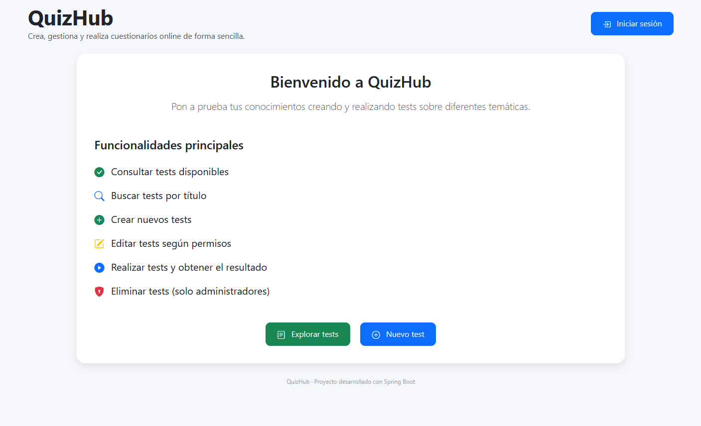
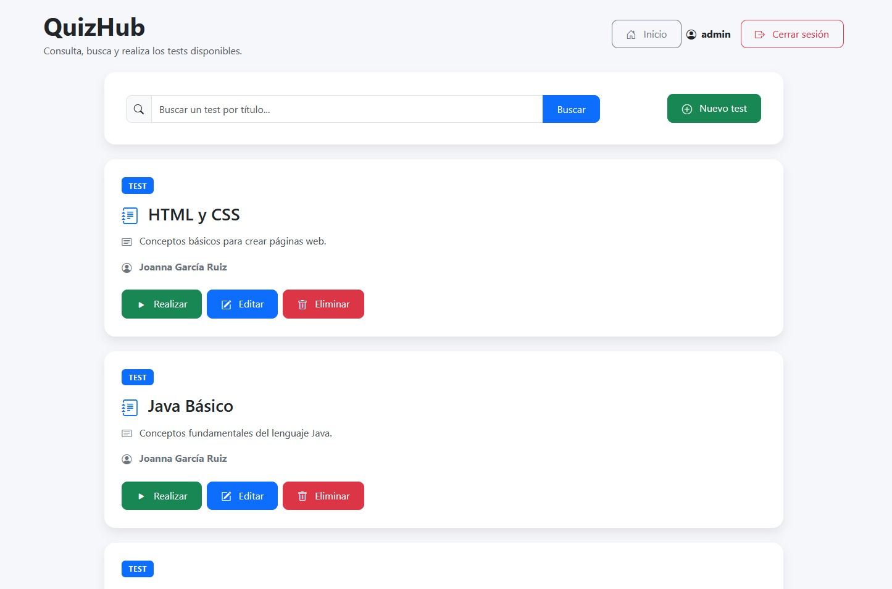
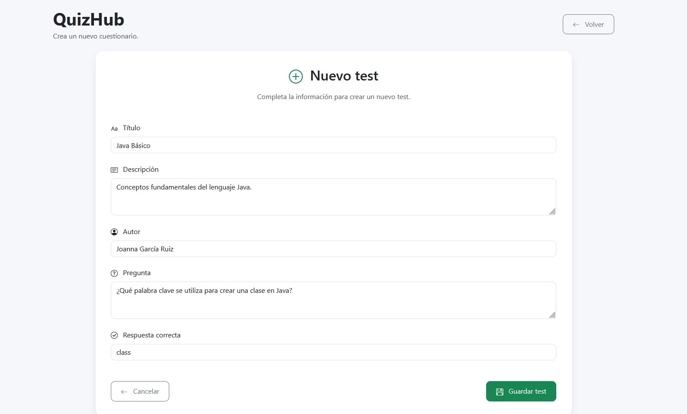
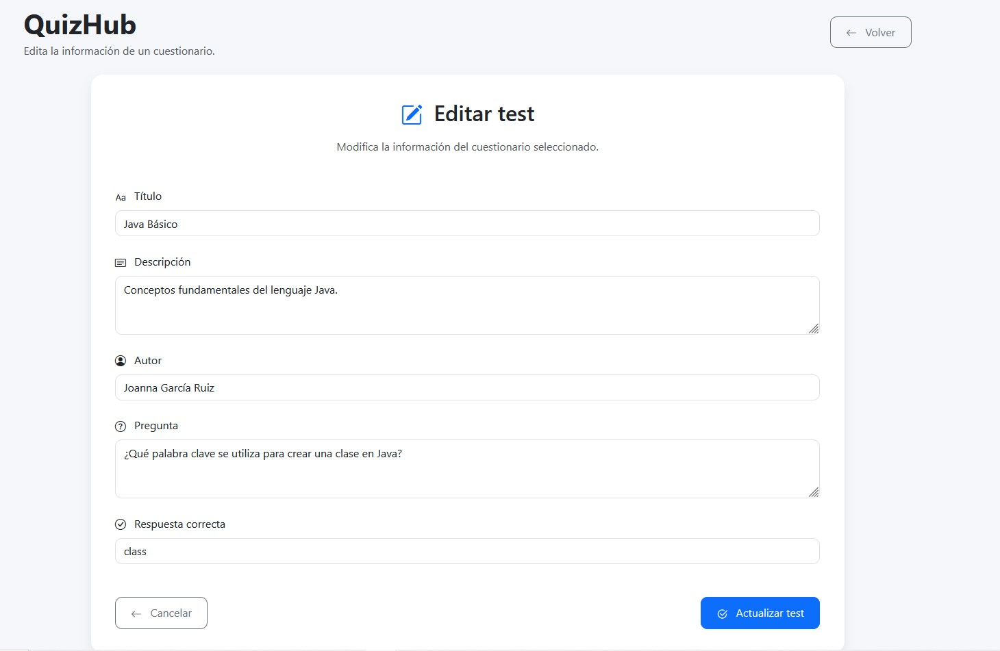
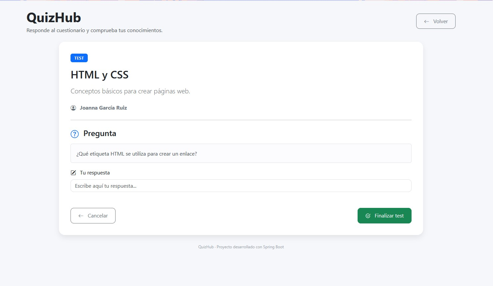
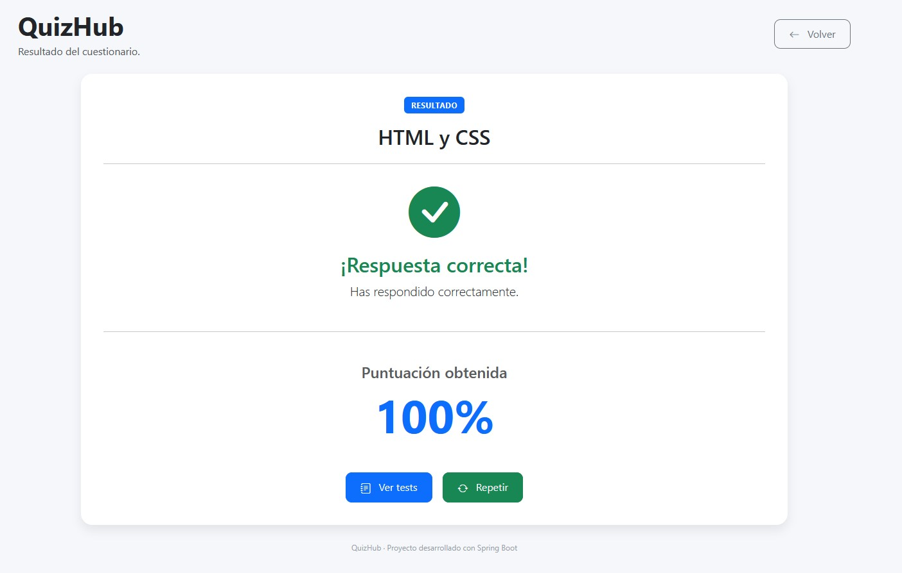
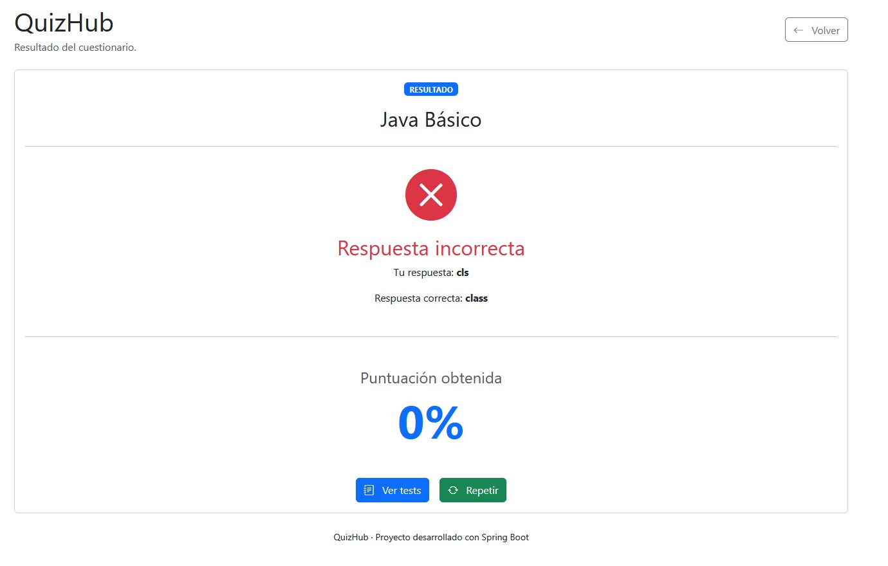

<p align="center">
    
</p>


QuizHub es una aplicación web desarrollada con **Spring Boot** que permite crear, consultar y realizar tests online de forma sencilla.

El proyecto ha sido desarrollado como parte del **Ciclo Formativo de Grado Superior en Desarrollo de Aplicaciones Multiplataforma (DAM)** con el objetivo de poner en práctica el desarrollo de aplicaciones web utilizando Spring Boot, Spring MVC, Spring Security, Spring Data JPA y Thymeleaf.

La aplicación permite gestionar tests mediante una interfaz web, realizar cuestionarios y acceder a una API REST para consultar la información de los tests.

## Índice

- Capturas
- Características
- Tecnologías utilizadas
- Arquitectura
- Estructura del proyecto
- Objetivos del proyecto
- Instalación
- Usuarios de prueba
- Base de datos
- API REST
- Mejoras futuras
- Autor

# Capturas

## Página principal



---

## Listado de tests



---

## Crear un nuevo test



---

## Editar un test



---

## Realizar un test



---

## Resultado correcto



---

## Resultado incorrecto



---

## Características

- Consulta del listado de tests disponibles.
- Búsqueda de tests por título.
- Realización de tests y obtención del resultado.
- Creación de nuevos tests mediante formulario.
- Edición de tests existentes.
- Eliminación de tests (solo usuarios con rol **ADMIN**).
- Autenticación y autorización mediante Spring Security.
- API REST para consultar y gestionar los tests.
- Persistencia de datos mediante Spring Data JPA y H2 Database.

## Tecnologías utilizadas

| Tecnología      | Descripción |
|-----------------|-------------|
| Java SE 17      | Lenguaje principal |
| Spring Boot     | Framework de desarrollo |
| Spring MVC      | Arquitectura web MVC |
| Spring Security | Autenticación y autorización |
| Spring Data JPA | Persistencia de datos |
| Thymeleaf       | Motor de plantillas |
| H2 Database     | Base de datos embebida |
| Maven           | Gestión de dependencias |
| Bootstrap 5.3   | Diseño responsive |
| IntelliJ IDEA   | Entorno de desarrollo |

## Arquitectura

QuizHub sigue una **arquitectura en capas** basada en el patrón **MVC (Model-View-Controller)**, separando claramente las responsabilidades de cada componente.

- **Model**: representa la entidad `Test` y sus validaciones.
- **Repository**: acceso a la base de datos mediante Spring Data JPA.
- **Service**: contiene la lógica de negocio de la aplicación.
- **Controller**: gestiona las peticiones web y la API REST.
- **View**: interfaces desarrolladas con Thymeleaf y Bootstrap.

Esta separación facilita el mantenimiento del código y hace que la aplicación sea más escalable.

## Estructura del proyecto

```text
src
├── main
│   ├── java
│   │   └── dev
│   │       └── joannagr
│   │           └── quizhub
│   │               ├── controller
│   │               ├── model
│   │               ├── repository
│   │               ├── security
│   │               ├── service
│   │               └── QuizHubApplication.java
│   │
│   └── resources
│       ├── templates
│       │   ├── error
│       │   ├── tests
│       │   └── index.html
│       ├── static
│       └── application.properties
│
└── pom.xml
```
## Objetivos del proyecto

Este proyecto ha sido desarrollado con el objetivo de consolidar conocimientos sobre:

- Desarrollo de aplicaciones web con Spring Boot.
- Arquitectura MVC.
- Persistencia de datos con Spring Data JPA.
- Seguridad mediante Spring Security.
- Desarrollo de APIs REST.
- Validación de formularios con Bean Validation.
- Integración de Thymeleaf con Bootstrap para la creación de interfaces web.

## Instalación

### Requisitos

Antes de ejecutar la aplicación es necesario disponer de:

- Java 17
- Maven
- IntelliJ IDEA (o cualquier IDE compatible con Maven)

### Clonar el repositorio

```bash
git clone https://github.com/joannagr-dev/quizhub.git
```

### Acceder al proyecto

```bash
cd quizhub
```

### Ejecutar la aplicación

Desde IntelliJ IDEA:

- Abrir el proyecto como proyecto Maven.
- Esperar a que Maven descargue las dependencias.
- Ejecutar la clase `QuizHubApplication`.

O desde la terminal:

```bash
./mvnw spring-boot:run
```

La aplicación estará disponible en:

```text
http://localhost:9005
```

## Usuarios de prueba

La aplicación incluye dos usuarios en memoria para facilitar las pruebas.

| Usuario | Contraseña | Rol |
|---------|------------|-----|
| user | 1234 | USER |
| admin | admin | ADMIN |

## Base de datos

La aplicación utiliza una base de datos **H2** almacenada en fichero.

### Consola H2

```
http://localhost:9005/h2-console
```

### Configuración

| Parámetro | Valor |
|-----------|-------|
| JDBC URL | `jdbc:h2:file:./data/quizhub` |
| Usuario | `sa` |
| Contraseña | *(vacía)* |

## API REST

La aplicación expone una pequeña API REST para gestionar los tests.

| Método | Endpoint | Descripción |
|---------|----------|-------------|
| GET | `/api/tests` | Obtener todos los tests |
| GET | `/api/tests/{id}` | Obtener un test por su identificador |
| POST | `/api/tests` | Crear un nuevo test |
| PUT | `/api/tests/{id}` | Actualizar un test existente |
| DELETE | `/api/tests/{id}` | Eliminar un test |


## Mejoras futuras

Algunas mejoras que podrían incorporarse en futuras versiones del proyecto:

- Soporte para múltiples preguntas por test.
- Gestión de usuarios mediante base de datos.
- Registro de usuarios.
- Historial de resultados.
- Categorías de tests.
- Temporizador durante la realización del test.
- Estadísticas de resultados.

## Autor

**Joanna García Ruiz**

Estudiante del CFGS de Desarrollo de Aplicaciones Multiplataforma (DAM).

Este proyecto ha sido desarrollado con fines formativos para practicar el desarrollo de aplicaciones web utilizando Spring Boot, Spring Security y Thymeleaf.